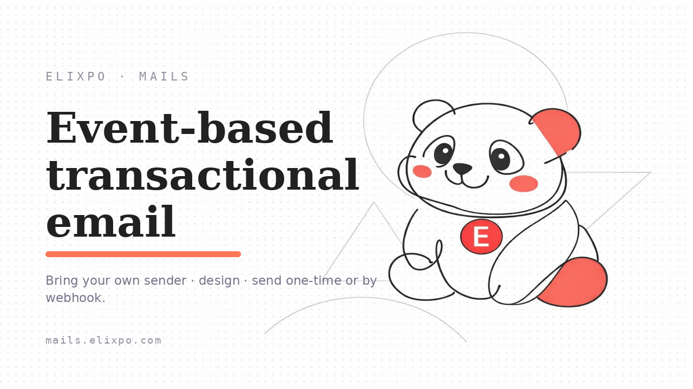

<p align="center">
  
</p>

<h1 align="center">Elixpo Mails</h1>

<p align="center">
  <strong>Branded transactional email, triggered by your product's events — sent from your own mailbox.</strong><br/>
  Shared mailing infrastructure for the open Elixpo ecosystem of AI and developer tools.
</p>

<p align="center">
  <a href="https://mails.elixpo.com">mails.elixpo.com</a> ·
  <a href="https://mails.elixpo.com/docs">Documentation</a> ·
  <a href="https://github.com/orgs/elixpo/discussions">Discussions</a> ·
  <a href="https://github.com/elixpo/elixpo_chapter">Monorepo</a> ·
  <a href="https://github.com/sponsors/Circuit-Overtime">Sponsor</a>
</p>

---

## About

**Elixpo Mails** is the multi-tenant, event-based transactional email service
for the Elixpo ecosystem. It helps a business send the everyday emails its
product needs to send — **receipts, welcome notes, order updates, password
resets, invoices** — beautifully designed, on-brand, and sent **automatically**
when something happens in their app.

No mail server to run. No email HTML to hand-write. No shared "noreply@" address —
the emails go out from **your own** mailbox, so they look like they came from you.
Within the ecosystem, Elixpo Mails is the **shared mailing infrastructure** that
backs the other Elixpo products.

> This repository is the source for the **mails.elixpo.com** hosted service.

### Who it's for

Any business or team that wants reliable, professional transactional email without
standing up a whole email platform. If your app needs to email a customer when they
sign up, pay, or place an order — this is for you.

### Why it's different

- **📤 Your own sender.** Connect your Gmail, Google Workspace, or any SMTP mailbox.
  Emails are sent *as you*, not from a shared pool — better trust and deliverability.
- **🎨 Design without code.** A visual editor (like writing a document) with
  `{{placeholders}}` for the bits that change per customer — names, amounts, links.
- **🏷️ On-brand by default.** Each product carries its own logo, address, phone, and
  footer, added to every email automatically.
- **📎 Attachments.** Attach a file from Google Drive, a link, or a per-send variable
  (e.g. each customer's own invoice).
- **🔕 Unsubscribe handled for you.** Built-in one-click unsubscribe and a suppression
  list, so you stay compliant without building anything.
- **📊 See every send.** A delivery log shows exactly what went out, to whom, and
  whether it landed.

### How it works — in four steps

1. **Connect a sender** — add the mailbox your emails should come from.
2. **Create a product** — this represents one of your services and holds its
   credentials and branding.
3. **Design a template** — write the email once, with `{{variables}}` for the
   personalized parts.
4. **Add a webhook** — your app calls a single secure URL when an event happens, and
   Elixpo Mails renders the template with that customer's details and sends it.

That's it — your product now sends polished, branded email on autopilot.

### Built on

Elixpo Mails runs entirely on **Cloudflare's edge** network for speed and
reliability — Pages + D1 + a `cloudflare:sockets` SMTP Worker (with send and
retry queues) — and signs in through **Elixpo Accounts** (SSO). Senders are
AES-GCM encrypted at rest, and webhooks are HMAC-signed. It's part of the Elixpo
suite of products and provides the shared mailing infrastructure for the rest of
the ecosystem.

## The ecosystem

| Tool | What it does | Link |
| --- | --- | --- |
| 🎨 **Elixpo Art** | AI image generation _(under dev)_ | [art.elixpo.com](https://elixpo.com) |
| ✍️ **Elixpo Blogs** | A rich, modern writing and publishing space | [blogs.elixpo.com](https://blogs.elixpo.com) |
| 🖊️ **LixSketch** | A hand-drawn style whiteboard for ideas and diagrams | [sketch.elixpo.com](https://sketch.elixpo.com) |
| 💬 **Elixpo Chat** | A fluid, real-time AI chat experience _(under dev)_ | [chat.elixpo.com](https://chat.elixpo.com) |
| 🔎 **Elixpo Search** | Fast, AI-assisted search | [search.elixpo.com](https://search.elixpo.com) |
| 👤 **Elixpo Accounts** | One identity (SSO) across the ecosystem | [accounts.elixpo.com](https://accounts.elixpo.com) |
| 🔗 **lixrl** | Our flagship URL shortener | [lixrl.com](https://lixrl.com) |
| 🪪 **Portfolios** | Personal pages to showcase your work | [me.elixpo.com](https://me.elixpo.com) |
| 🐼 **Oreo** | The mascot's home | [oreo.elixpo.com](https://oreo.elixpo.com) |

Developers can drop our editors into their own projects with the
**`@elixpo/lixsketch`** and **`@elixpo/lixeditor`** packages, on npm and as VS
Code extensions.

## For developers

The full API reference — authentication, the trigger endpoint, templates, variables,
attachments, and unsubscribe — lives at **[mails.elixpo.com/docs](https://mails.elixpo.com/docs)**
(with a one-click "Copy for LLM" button).

### Running locally

```bash
npm install
npm run dev
```

Then open [http://localhost:3000](http://localhost:3000).

Useful scripts (see `package.json` for the full list):

```bash
npm run build              # Production build
npm run pages:build        # Build for Cloudflare Pages
npm run lint               # Biome check
npm run db:migrate         # Apply D1 migrations (remote)
npm run db:migrate:local   # Apply D1 migrations (local)
npm run queues:create      # Create the send / retry queues
npm run worker:deploy      # Deploy the SMTP sender Worker
```

Deployment is driven by `deploy.sh` and `wrangler.toml`.

## Built by the community

Elixpo is made by people, in the open. **45+ contributors** have shaped these
tools, with a small core team steering the way:

- **Ayushman Bhattacharya** - Founder & Lead ([@Circuit-Overtime](https://github.com/Circuit-Overtime))
- **Vivek Yadav** - Lead Co-Dev ([@ez-vivek](https://github.com/ez-vivek))
- **Anwesha Chakraborty** - Core Maintainer ([@anwe-ch](https://github.com/anwe-ch))

Everyone is welcome. See **[CONTRIBUTING.md](CONTRIBUTING.md)** and our
**[Code of Conduct](CODE_OF_CONDUCT.md)**.

## Recognition & programs

Elixpo has taken part in and been supported by **GSSOC**, **Hacktoberfest**,
**Pollinations.AI**, **MS Startup Foundations**, and **OSCI**.

## Get involved

- 💬 **Join the conversation** in [GitHub Discussions](https://github.com/orgs/elixpo/discussions).
- 🚀 **Submit your project** to be featured across the ecosystem.
- 🛠️ **Contribute** - browse good first issues in the [monorepo](https://github.com/elixpo/elixpo_chapter).
- ❤️ **Support us** via [GitHub Sponsors](https://github.com/sponsors/Circuit-Overtime).

## Brand assets

Brand-ready marks and icons live under [`public/`](public/) (logo, mark, and the
icon set). The ecosystem brand source of truth (mascot, palette, rules) is at
**[elixpo.com/assets](https://elixpo.com/assets)**.

## License

Elixpo uses one **licensing standard** across every repository:

- **Code** - [MIT](LICENSES/preferred/MIT) (with the [Oreo-trademarks exception](LICENSES/exceptions/Oreo-trademarks)).
- **Brand & visual assets** - [CC-BY-4.0](LICENSES/preferred/CC-BY-4.0) (with the same exception).

The Oreo mascot, the chest E-badge, and the "Elixpo" and "Oreo" names, domains,
and palette are reserved - this protects the brand and its royalties while
keeping the code and assets free. See [`LICENSE`](LICENSE) and the per-product
notice board, [`NOTICE`](LICENSES/NOTICE).

## Exclusive

> Per-repo "exclusive" artifacts (an npm package, a VS Code extension, a hosted
> SaaS, a paid tier) are declared here and in [`NOTICE`](LICENSES/NOTICE).

**This repository:** None - it does not publish an npm package, a marketplace
extension, or a separately-licensed binary. mails.elixpo.com is the official
hosted deployment; the brand and the hosted deployment are reserved, but the
source carries the full MIT / CC-BY-4.0 grant.

---

<p align="center"><sub>Made in the open, together. © 2024–2026 Elixpo Mails · Sent with care.</sub></p>
